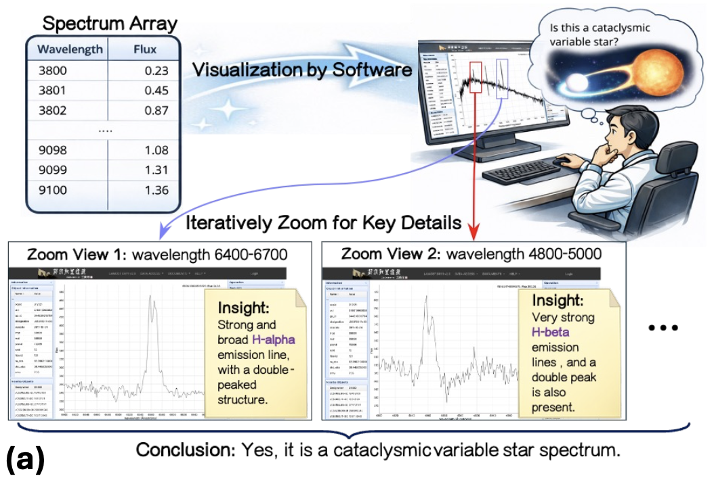
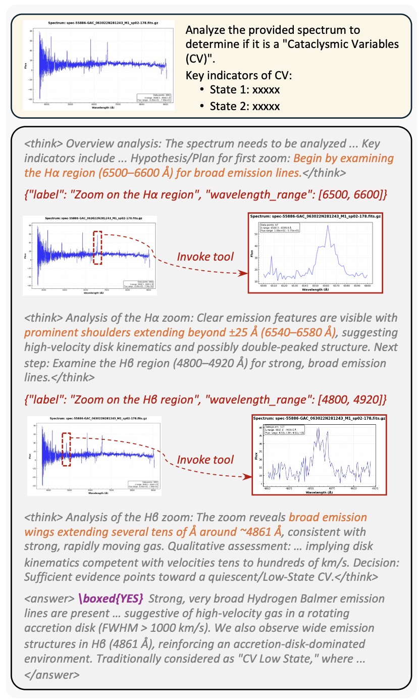
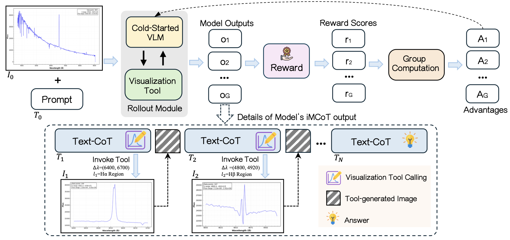
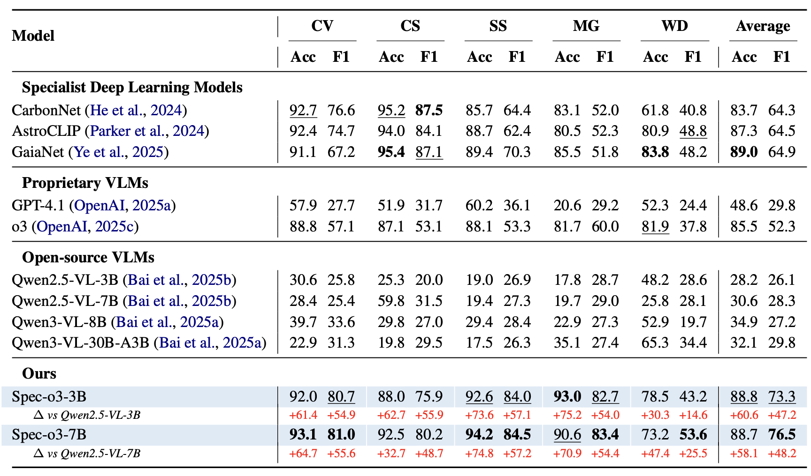

<div align="center">
  <h1 style="font-size: 32px; font-weight: bold;"> Spec-o3: Tool-Augmented Vision-Language Agent for Astronomer-Aligned Spectral Inspection
 </h1>

  <br>

  <!-- <a href="https://arxiv.org/abs/2511.05271">
    
  </a> -->
  <a href="https://huggingface.co/datasets/Maxwell-Jia/Spec-o3-ColdStartSFT">
    
  </a>
  <a href="https://huggingface.co/datasets/Maxwell-Jia/SpecVI-Bench">
    
  </a>
  <a href="https://huggingface.co/Maxwell-Jia/spec-o3-3b">
    
  </a>
  <a href="https://huggingface.co/Maxwell-Jia/spec-o3-7b">
    
  </a>
  <a href="https://github.com/Maxwell-Jia/spec-o3">
    
  </a>
</div>

## Background

Modern spectroscopic surveys produce massive candidate lists, but the final quality-control step still relies on expert visual inspection, which is difficult to scale.  
Spec-o3 is a tool-augmented vision-language agent that follows astronomers’ workflow by iteratively zooming into diagnostic wavelength windows and making evidence-grounded vetting decisions.



*Expert workflow for spectral candidate vetting: visualize the spectrum, iteratively zoom into key wavelength regions, and conclude based on localized evidence.*

## Example

Spec-o3 performs spectral inspection in a multi-turn loop: it plans which diagnostic region to examine, invokes a visualization tool with a wavelength window, updates its hypothesis based on the zoomed view, and repeats until it reaches a final decision.



*An example trajectory showing (1) an inspection plan, (2) tool calls with wavelength ranges, (3) zoomed spectral views returned by the tool, and (4) a final evidence-grounded verdict.*

## Training Pipeline

Spec-o3 is post-trained in two stages: **cold-start supervised fine-tuning (SFT)** on expert inspection trajectories to bootstrap stable tool use, followed by **outcome-based GRPO** on label-only inspection tasks to improve accuracy and inspection policy.



*Overview of the post-training pipeline. The agent alternates between text reasoning and wavelength-window tool calls to produce interleaved multimodal trajectories, which are then optimized with group-wise reinforcement learning.*

## Main Results

Spec-o3 achieves strong performance on the SpecVI-Bench evaluation suite and substantially improves over its base VLMs after two-stage post-training.



*Performance comparison on SpecVI-Bench. Replace with your Table 1 screenshot or a re-drawn table. You may optionally add a short bullet list here summarizing the macro-average F1 gains (e.g., Spec-o3-7B: 76.5; Spec-o3-3B: 73.3).*

## Quick Start

### DATA
- Cold Start: [https://huggingface.co/datasets/Maxwell-Jia/Spec-o3-ColdStartSFT](Spec-o3-SFT)
- RL: [https://huggingface.co/datasets/Maxwell-Jia/SpecVI-Bench](Spec-o3-RL)

### Cold Start
We use [LLaMA-Factory](https://github.com/hiyouga/LLaMA-Factory) to conduct cold start.

#### Environment Setup
Please refer to [LLaMA-Factory](https://github.com/hiyouga/LLaMA-Factory) for more details on installing.

#### Cold Start Training
We use [Qwen-2.5-VL-3B-Instruct](https://huggingface.co/Qwen/Qwen2.5-VL-3B-Instruct) and [Qwen-2.5-VL-7B-Instruct](https://huggingface.co/Qwen/Qwen2.5-VL-7B-Instruct) as our foundation model.

```bash
bash ./cold_start/run_cold_start.sh
```

### Reinforcement Learning
We use verl [verl](https://github.com/volcengine/verl) framework.

#### Environment Setup

```bash
cd reinforcement_learning
# Follow the VeRL official installation procedure
pip install -r requirements-spec_o3.txt
```

#### Training

```bash
cd reinforcement_learning
# your wandb access key here...
wandb login

bash reinforcement_learning/recipe/spec_o3/run_spec_o3.sh
```
